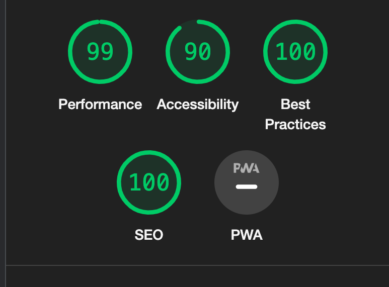

# South East Breastfeeding Support
## Portfolio Project 1 - HTML/CSS Essentials
-----

South East Breastfeeding Support website is a landing page for mothers and parents of newborns looking for support with breastfeeding in the South-East of Ireland. 

The website is aimed to target parents of newborns of any background, looking for advice, education or help with breastfeeding. 

The support is offered by a specialist midwife either at a venue or online, as a class group or individual or privately in your own home. 

Users of South-East Breastfeeding Support will be able to access all the information they need on the site. Including About the Midwife, Services offered, Where to find her and how to Get in touch. 

## Live Project
-----
[View the live project here.]() <!--insert live website link-->

## Repository
-----
[View the project repository here.]() <!--insert repo link-->

# Table of Contents

## Contents
-----

- [Design](#design)
- [Wireframe](#wireframe)
- [Features](#features)
- [Technologies Used](#technologies-used)
- [Testing](#testing)
- [Deployment](#deployment)
- [Credits](#credits)
- [Acknowledgements](#acknowledgements)

# Design 

- I used a simple colourscheme in my project. It presents a calming and professional aesthetic.

- The head and body colours complement eachother and the background colours enable these to stand out. 

## Typography
-----
- I used [Heebo](https://fonts.google.com/specimen/Heebo?query=heeb) for my body and [Ubuntu](https://fonts.google.com/specimen/Ubuntu?query=ubuntu) for my headings. Ubuntu uses a sans-serif typeface and Heebo is easy to read. 

- A fallback font of Sans-Serif has been selected for headings and body respectively, should a browser be unable to load my chosen fonts. 

## Icons
-----
- I used icons from [font awesome](https://fontawesome.com/) alongside my headings to compliment the text. 

# Wireframe

 
 
 

# Features 

## Navigation
-----
* Featured at the top of the page, the navigation bar shows the page name in the center: South-East Breastfeeding Support, which links to the main page when clicked. 
* The other navigation links are in the hamburger menu button to the left of the page name, and link to the About, Services and Contact sections of the page. 
* The heading text is smart and professional and contrasts well. 
* The navigation bar clearly states the name of the page and and is easy to use to locate other page sections 
* The navigation bar sticks to the top of the page at all times to allow the user continuous navigation on the page. 

 

## Header Image
-----
* Featured below the navigation bar, the main image offers a clear image of a newbrn breastfeeding. 
* it is calm and relaxed and inkeeping with the colour scheme of the site. 
* The image clearly relates back to the purpose of the site. 

## About Me Section
-----
* The about me section lists the midwives qualifications whilst also making it personal, to bulid the clients trust. 
* It remains professional and gives the clients a sense of the person they will meet. 

 

## Services Section 
-----
* This section essentially gives clients a menu of the services offered by the midwife, with a small summary of what each service provides and the price.
* There are four types of services offered, An online group class, an at home or online consultation and an individual tailored class. 
* It is styled with relevant images of breastfeeding mothers and a pregnant woman, in-keeping with the professional feel of the website. 
* This section offers the most important information on the site and is where the user will find useful information about the services offered. 

 

## Contact Section
-----
* The contact section gives information about how to get in touch with the midwife. It provides a contact number, email address and loaction.
* The location is also backed up with an interactive google map. 
* There is an enquiry form with a drop down menu for the specific area of interest. It requests the users name, email and gives the option for free text also. 
* This is a valuable section to the potential client as it provides all necessary information to get in touch and a direct enquiry box to the midwife. 

 

## Footer 
-----
* The footer gives social media account links at the bottom of the page. 
* It is a valuable tool to the user as it further backs up the information on the page should the client wish to research further. 

# Technologies Used

## Languages Used
-----
- [HTML5](https://en.wikipedia.org/wiki/HTML5)

- [CSS](https://en.wikipedia.org/wiki/CSS)

## Frameworks and Programs
-----
- [Google Fonts](https://fonts.google.com/)
   - I imported two fonts. Ubuntu and Heebo. 

- [Font Awesome](https://fontawesome.com/)
   - I used icons from font awesome to compliment my headings. 

- [Github](https://github.com/) 
   - Github was used to create and store my project.

- [Gitpod](https://gitpod.io)
   - Gitpod is where I wrote my code and stored it during creation. 

- [Balsamiq](https://balsamiq.com)
   - I used Balsamiq to create my wireframe at the initial inception stage of my project.

- [Google Chrome Devtools](https://developer.chrome.com/docs/devtools/)
   - Devtools were used whilst creating the project to ensure functionality and responsiveness.

## API's
-----
[Google Maps Geocoding API](https://developers.google.com/maps/documentation/geocoding)

- I used Google's geocoding API to create my google map in the contact section. 

# Testing 

* I confirmed that the page works in different browsers: Safari and Chrome, by opeing the page within each of these. 
* I ensured that all links within the page function appropriately and that all external links open in a new browser.
* I ensured that the wedsite is responsive and that it works on various screen sizes, using devtools and my own different devices. 
* I made sure that all elements are readable and easy to understand by choosing contrasting colours.
* I have confirmend that the form works, required fields that must be populated and email section only accpets an email address, and the submit button works, by filling out the form myself.

# Bugs

* - Problem: Couldn't get my Logo to centre at the top of the page.
  - Cause: There was a style rule further up in the CSS that was over-riding my logo specific rule.
  - Resolution: Once identified, I changed the initial style rule which allowed my logo specific rule to take effect. 

* - Problem: Couldn't get my images in the services section to fill the space required.
  - Cause: Using an image tag would not behave appropriatley for what I was trying to achieve.
  - Resolution: I used background-image in CSS instead so as I could set the size to cover.

* - Problem: My services section would not stack when I applied my media query rule. 
  - Cause: I was missing a closing div tag at the end of one of my sections. 
  - Resolution: Once identified I added in the div and it functioned properly. 

* - Problem: Lighthouse accessibility is 90% because of a missing label for the checkbox in the hamburger menu. 
  - Cause: The input type checkbox does not have a label. 
  - Resolution: This bug is NOT resolved as I cannot find a way for this input to accept a label tag without interrupting its functionality.   

* - Problem: My nav bar list items were dissappearing off the side of the screen when viewed on mobile devices.
  - Cause: I had a margin-left set to -40px which was pushing the text off the screen.
  - Resolution: I deleted the line of code as it had very little effect on the larger screen view, and it now works on all screen sizes.   

### Validator Testing
-----
- HTML 
 No errors were shown on the official W3C validator. 

- CSS
 No errors were found on the official W3C CSS validator. 

- Accessibility 
   - I have confirmed that my fonts and colours are easy to read and that my site is accessible to all users. 

 

 # Deployment

 - The site was deployed to GitHub pages by the following steps;
   - In the GitHub repository navigate to settings.
   - Scroll down to pages, and from the source menu select Main. 
   - Once this has been selected a link was generated to the completed site. 

# Credits

## Content
-----
The code to make the hamburger menu was adapted from [https://alvarotrigo.com/blog/hamburger-menu-css/#:~:text=What%20Is%20A%20Hamburger%20Menu,top%20of%20the%20main%20content]

The code to assist me in making the grid layout was taken from [https://cssgrid-generator.netlify.app/]

Some code for my enquiry form and circle image was taken from Love Running. 

## Media
-----
Images are from [Pexels](https://www.pexels.com/) and [Unsplash](https://unsplash.com/)

# Acknowledgements 

- Thank you to my mentor Richard Wells for the feedback and recommended tools.
- Thank you to Claire Ferris for allowing me to use her small business as inspiration for my project.
- Thankyou to my family for the feedback and testing of the website.
- Thank you to my peers on Slack for help and inspiration. 

Please note that this website is solely for project purposes and is not intended for use. 

Evangeline Mills, 2022

